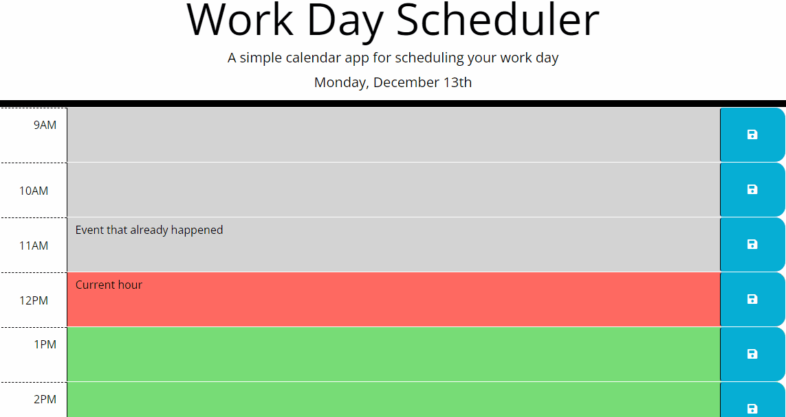

 Work Day Scheduler

## Description

The Work Day Scheduler is a simple calendar app that helps you schedule your workday effectively. It provides a user-friendly interface to organize your tasks and appointments for the day.

## Features

- **Hourly Time Blocks**: The scheduler is divided into hourly time blocks from 9 AM to 5 PM, making it easy to plan your day.

- **Real-time Styling**: Each time block is color-coded to indicate whether it's in the past, present, or future based on the current time.

- **Task Input**: You can input your tasks and appointments for each hour by typing directly into the text areas provided.

- **Save Functionality**: There's a save button for each time block that allows you to save your task for that specific hour. Your tasks will persist even if you refresh the page.

- **Current Date Display**: The current date is displayed in the header, helping you stay organized and aware of the date while scheduling.

## How to Use

1. Open the Work Day Scheduler webpage in your browser.
2. Observe the color coding of the time blocks to identify past, present, and future hours.
3. Click on the text areas for the respective hours and enter your tasks or appointments.
4. Click the "Save" button for each time block to save your input.

## Technologies Used

- HTML
- CSS (Bootstrap)
- JavaScript
- jQuery
- Day.js (for working with dates and times)

## Getting Started

Deployed Webpage:

https://daleray1231.github.io/workDayScheduler 

GitHub Repo: 

https://github.com/Daleray1231/workDayScheduler 

## License

This project is licensed under the [MIT License](LICENSE).

